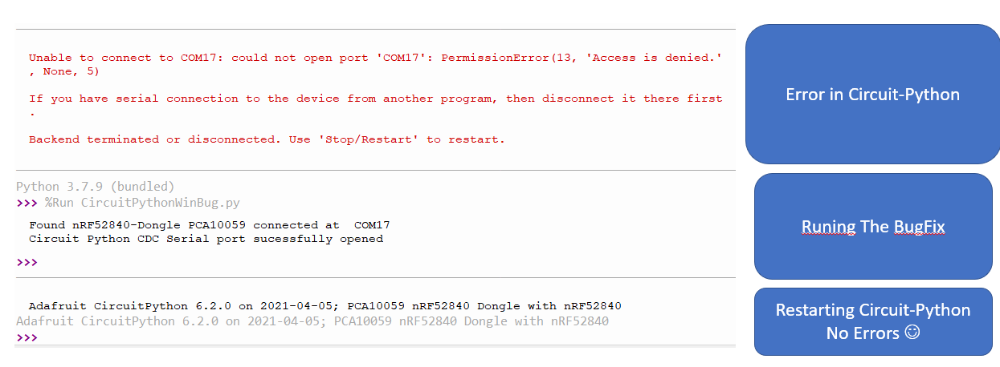

# nRFCircuitPyFix
Thonny Circuit python serial port fix for windows on nRF52840-Dongle PCA10059

Quick for enabling Thony to run nRF52840-Dongle PCA10059 on windows.
This is a fix for a bug in the Circuit-Python CDC windwos Driver by
toogeling the software/Hardware handshake (dsrdtr,rtscts,xonxoff)

Unplug/Plug in the nRF52840-Dongle before running the script CircuitPythonWinBugFix.py

